# Neural Style Transfer
## Matthew Richtmyer | May 2020

__Snapshot__:
* Explore one application of Convolutional Neural Networks and utilize the TensorFlow image pipeline tool to eleagantly handle input datastrems
* Utilize Transfer Learning to pull weights from the VGG-16 network
* Create novel images using General Adverserial Netoworks. The Neural Style Transfer maximizes a custom loss function, which considers both the source and style images respectively. 

__Usage__:
* Clone this repo
* Download the pre-trained VGG-16 network and store in root directory
* Go to this link: https://www.cs.toronto.edu/~frossard/post/vgg16/#architecture
    * Download the  vgg16_weights.npz

__Conclusions__:
* Our generated images are directly effected by the number of layers in VGG-16 that we include. Deeper layers will have activations that more specifically describe the input (versus low levels which have low level features, like a simple Gaussian Curve).
* Modifying the alpha and beta hyperparameters allow us to control how much the style image is incorperated into the generated image. This is useful to allow us to generate images that are slightly more "realistic", which could be useful from a image augmentation perspective. 
---
# Full Presentation

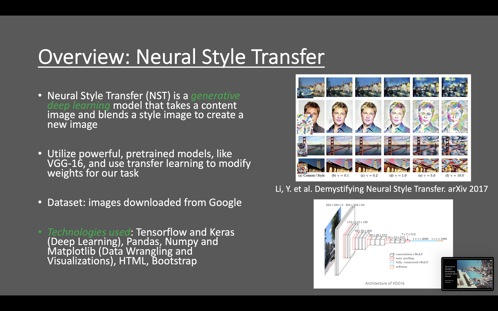
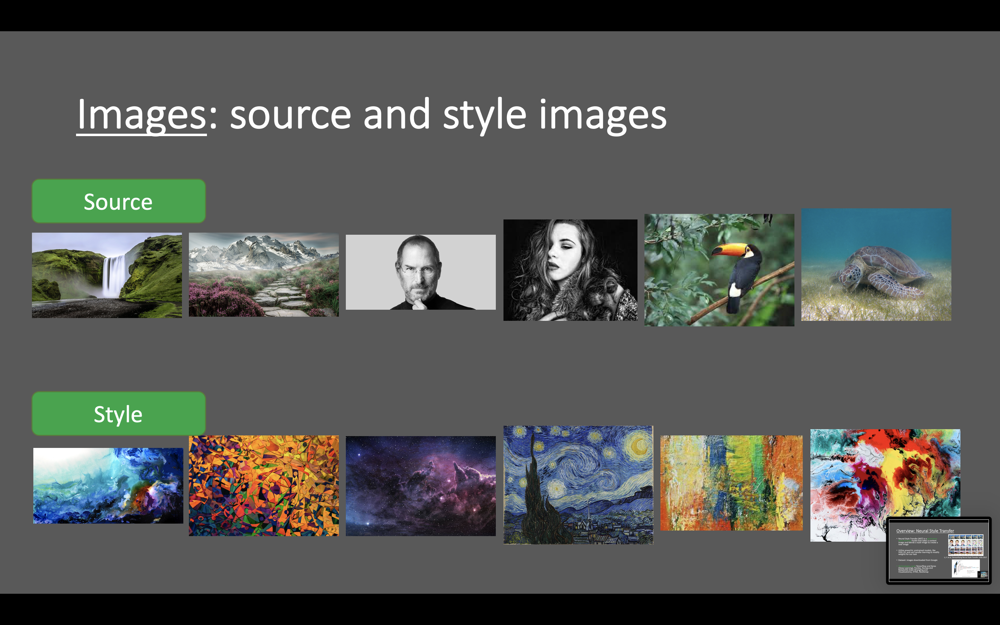
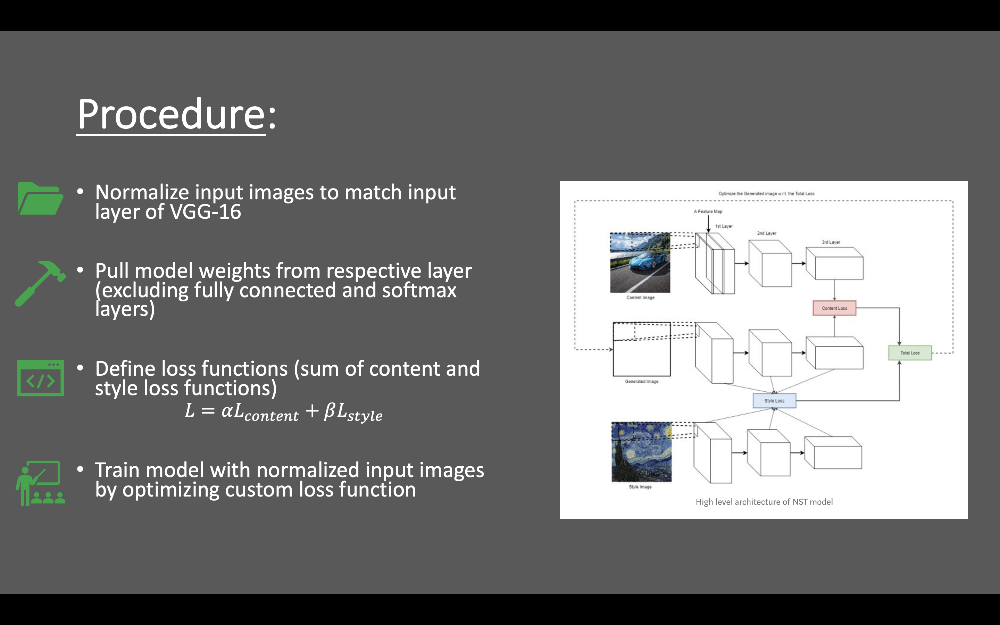
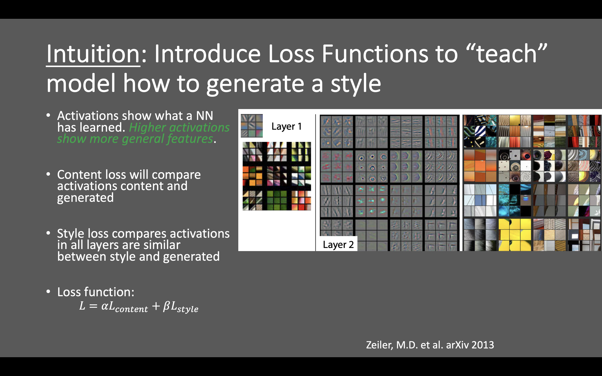
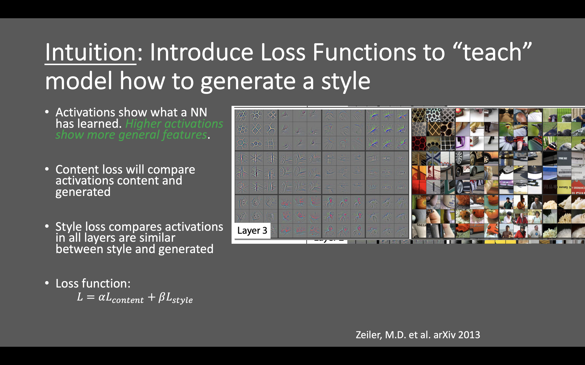
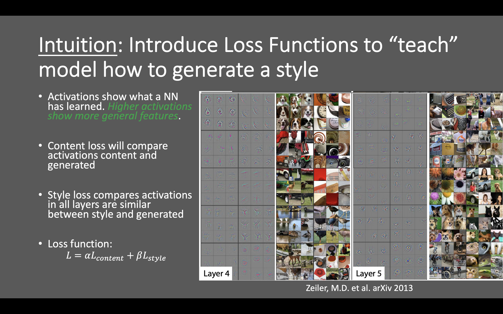
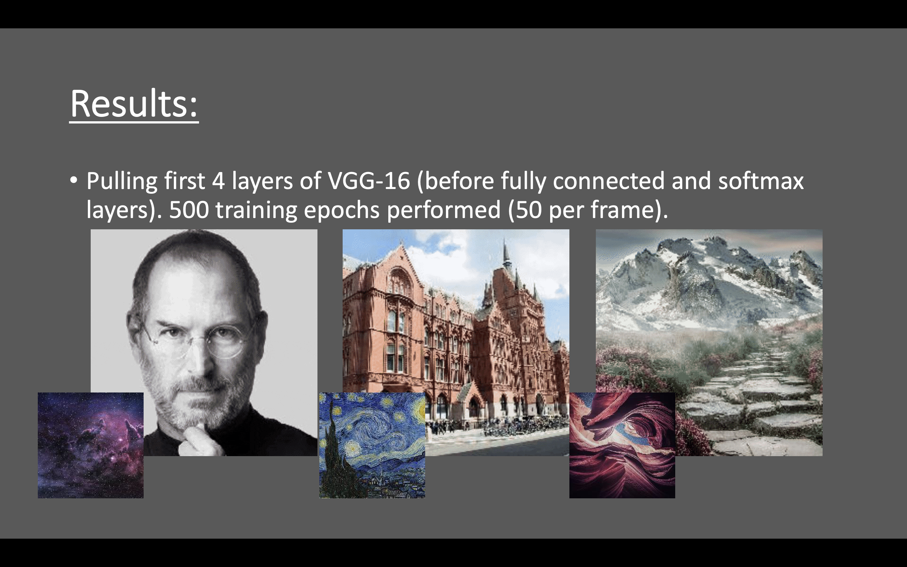
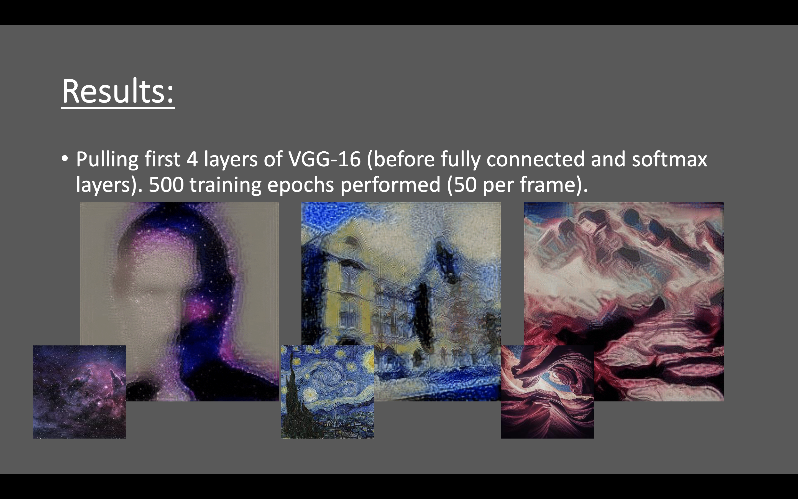
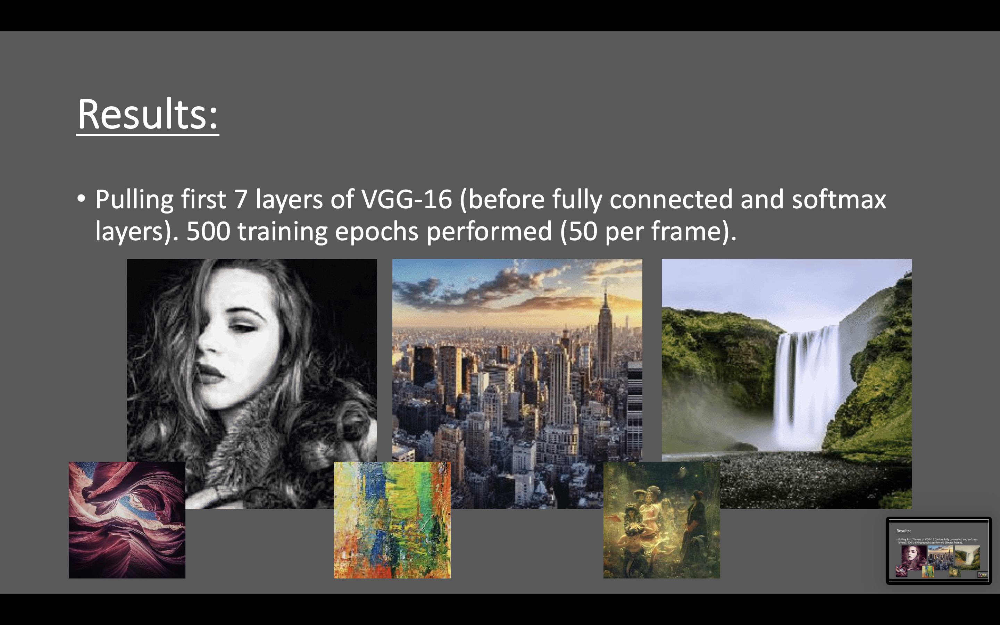

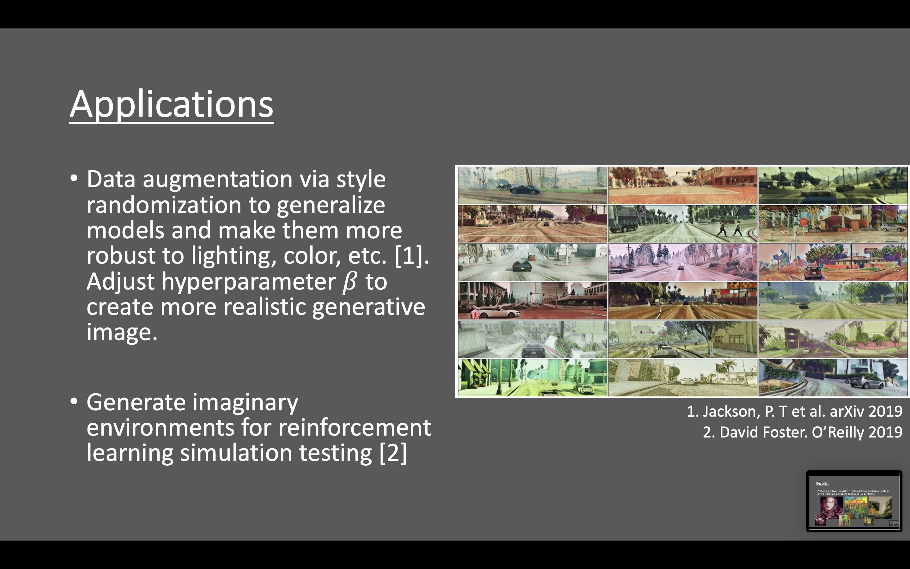
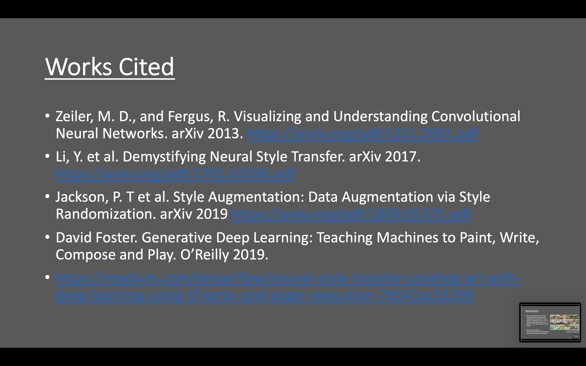

